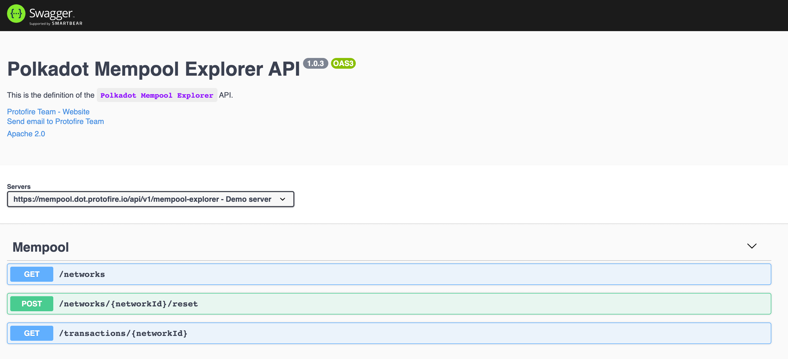

# Polkadot Mempool Explorer API

Mempool Explorer API Definition [api-docs](https://mempool.dot.protofire.io/api/v1/api-docs).

## Environment setup

 - Install [Node.js](https://nodejs.org/)
   - Recommended method is by using [NVM](https://github.com/creationix/nvm)
   - Recommended Node.js version is v12

## Demo

[mempool.dot.protofire.io](https://mempool.dot.protofire.io)

## Custom Polkadot Node

In order to track extrinsics lifecycle. We added a new RPC method ([author_trackExtrinsic](https://github.com/protofire/polkadot-mempool-explorer/blob/develop/api/services/polkadot/custom-rpc-methods.js)) on [Substrate core](https://github.com/jarcodallo/substrate/blob/master/client/rpc-api/src/author/mod.rs).

This basically allows someone to subscribe and track status changes in the extrinsics lifecycle, for example movements getting in or out of queues, and everything that matters for us before including those extrinsics in blocks.
  
 - Substrate change: [github.com/paritytech/substrate](https://github.com/jarcodallo/substrate/commits/master)
 - Polkadot dependencies update: [github.com/paritytech/polkadot](https://github.com/jarcodallo/polkadot/commits/master)
 - Docker image of the polkadot binary: [hub.docker.com/polkadot](https://hub.docker.com/repository/docker/jarcodallo/polkadot)

## Get Started

In the project directory, you can run:

### `npm start`

Runs the NodeJs service in the development mode.\
Open [localhost:8081/api/v1/api-docs](http://localhost:8084/api/v1/api-docs) to view it in the browser or Postman.

The service will reload if you make edits.

### `npm run test`

Running the unit tests.

## Mempool Explorer API Definition

## Endpoints

 - `/networks`: Get networks [specs](https://github.com/protofire/polkadot-mempool-explorer/blob/main/api/routes/explorerApiDocumentation.js#L32-L65).
 - `/networks/:networkId/reset`: Reset the listener for a network id. [specs](https://github.com/protofire/polkadot-mempool-explorer/blob/main/api/routes/explorerApiDocumentation.js#L66-L95).
 - `/transactions/:networkId`: Get transactions by network id. [specs](https://github.com/protofire/polkadot-mempool-explorer/blob/main/api/routes/explorerApiDocumentation.js#L96-L133).